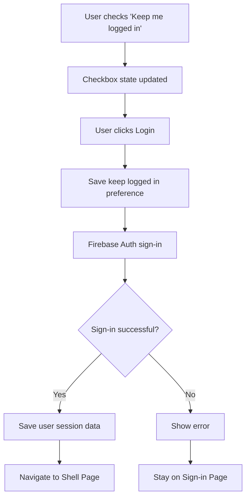
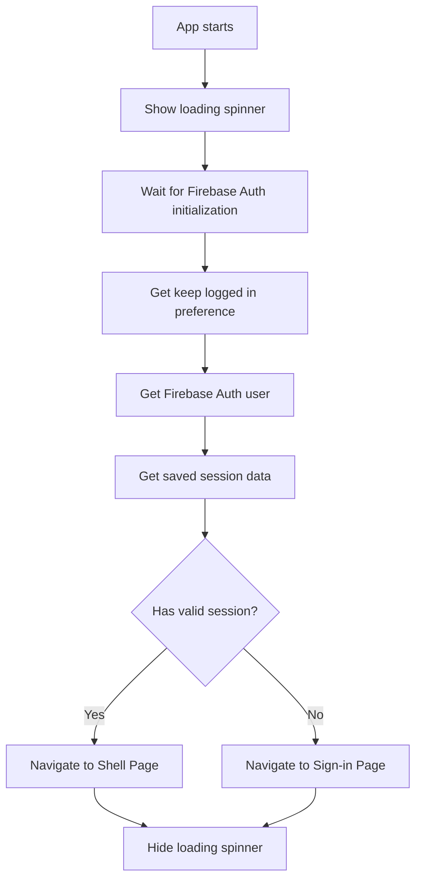

# Keep Me Logged In Functionality Documentation

## Overview

The "Keep Me Logged In" functionality allows users to remain authenticated across app restarts on desktop applications. This feature addresses the limitation where Firebase Auth doesn't persist sessions properly on desktop platforms by implementing custom session persistence using SharedPreferences.

## Architecture

### Components

1. **AuthPersistence** (`lib/features/auth/services/auth_persistence.dart`)

   - Manages user session data storage
   - Handles SharedPreferences operations
   - Stores keep logged in preference

2. **AuthBloc** (`lib/features/auth/bloc/auth_bloc.dart`)

   - Handles authentication logic
   - Saves user session on successful sign-in
   - Clears session data on sign-out

3. **AuthWrapper** (`lib/main.dart`)

   - Manages app startup authentication state
   - Determines initial route based on session validity
   - Handles loading state during auth check

4. **SignInPage** (`lib/features/auth/pages/signin_page.dart`)
   - Manages checkbox state
   - Saves keep logged in preference
   - Handles user interaction

## Data Flow

### Sign-In Process



### App Startup Process



## Implementation Details

### Session Data Storage

The system stores the following data in SharedPreferences:

```dart
// Keys used for storage
static const String keyKeepLoggedIn = 'keep_logged_in';
static const String keyUserEmail = 'user_email';
static const String keyUserId = 'user_id';
```

### Session Validity Logic

A session is considered valid if:

1. Firebase Auth has an active user, OR
2. Keep logged in is enabled AND saved session data exists (email and UID)

```dart
final hasValidSession = (user != null) ||
    (keepLoggedIn && savedSession['email'] != null && savedSession['uid'] != null);
```

## File Structure

```
lib/
├── main.dart                          # AuthWrapper implementation
├── features/auth/
│   ├── bloc/
│   │   └── auth_bloc.dart            # Authentication logic
│   ├── pages/
│   │   └── signin_page.dart          # Sign-in UI and checkbox handling
│   └── services/
│       └── auth_persistence.dart     # Session data management
```

## Key Methods

### AuthPersistence

```dart
// Save keep logged in preference
static Future<void> setKeepLoggedIn(bool value)

// Get keep logged in preference
static Future<bool> getKeepLoggedIn()

// Save user session data
static Future<void> saveUserSession(User user)

// Get saved session data
static Future<Map<String, String?>> getSavedUserSession()

// Clear all session data
static Future<void> clear()
```

### AuthBloc

```dart
// Handle sign-in event
on<SignInEvent>((event, emit) async {
  // ... sign-in logic
  if (keepLoggedIn) {
    await AuthPersistence.saveUserSession(user);
  }
})

// Handle sign-out event
on<SignOutEvent>((event, emit) async {
  // ... sign-out logic
  await AuthPersistence.clear();
})
```

## Debugging

### Debug Output

The system provides comprehensive debug logging:

```
=== AUTH WRAPPER DEBUG ===
Keep logged in: true
Firebase User: null
Firebase User email: null
Saved session email: user@example.com
Saved session UID: user-uid-123
Has valid session: true
Should go to shell: true
==========================
```

### Common Debug Scenarios

1. **User not staying logged in:**

   - Check if `Keep logged in: true`
   - Verify `Saved session email` and `Saved session UID` are not null
   - Ensure `Has valid session: true`

2. **User forced to sign in despite checking keep logged in:**

   - Check if session data is being saved during sign-in
   - Verify SharedPreferences is working correctly
   - Check for any errors in the console

3. **User stays logged in when they shouldn't:**
   - Verify sign-out process clears all data
   - Check if `AuthPersistence.clear()` is being called

### Debug Commands

Add these print statements for additional debugging:

```dart
// In AuthPersistence.getKeepLoggedIn()
print('DEBUG: Retrieved keep logged in: $value');

// In AuthPersistence.saveUserSession()
print('DEBUG: Saving session for user: ${user.email}');

// In AuthPersistence.clear()
print('DEBUG: Clearing all auth data');
```

## Testing

### Test Cases

1. **Keep Logged In Enabled:**

   - Check "Keep me logged in" checkbox
   - Sign in successfully
   - Close app completely
   - Reopen app
   - **Expected:** Automatically redirect to shell page

2. **Keep Logged In Disabled:**

   - Leave "Keep me logged in" unchecked
   - Sign in successfully
   - Close app completely
   - Reopen app
   - **Expected:** Redirect to sign-in page

3. **Manual Logout:**

   - Sign in with "Keep me logged in" checked
   - Click logout button
   - Close and reopen app
   - **Expected:** Redirect to sign-in page

4. **Session Expiry:**
   - Sign in with "Keep me logged in" checked
   - Clear SharedPreferences manually
   - Reopen app
   - **Expected:** Redirect to sign-in page

## Troubleshooting

### Common Issues

1. **Firebase Auth Session Not Persisting:**

   - **Cause:** Desktop platform limitation
   - **Solution:** Custom session persistence (already implemented)

2. **Checkbox State Not Saving:**

   - **Cause:** State management issue
   - **Solution:** Ensure `setState()` is called when checkbox changes

3. **Session Data Not Clearing on Logout:**

   - **Cause:** `AuthPersistence.clear()` not called
   - **Solution:** Verify sign-out process calls clear method

4. **App Crashes on Startup:**
   - **Cause:** Null reference or async issue
   - **Solution:** Check AuthWrapper initialization logic

### Error Messages

- `The 'firebase_auth_plugin/id-token/[DEFAULT]' channel sent a message from native to Flutter on a non-platform thread`
  - **Impact:** Non-critical, Firebase Auth threading issue
  - **Action:** Can be ignored, doesn't affect functionality

## Maintenance

### Adding New Session Data

To store additional user data:

1. Add new key to `AuthPersistence`:

```dart
static const String keyNewData = 'new_data';
```

2. Update `saveUserSession` method:

```dart
await prefs.setString(keyNewData, user.newData);
```

3. Update `getSavedUserSession` method:

```dart
final newData = prefs.getString(keyNewData);
return {'email': email, 'uid': userId, 'newData': newData};
```

4. Update `clear` method:

```dart
await prefs.remove(keyNewData);
```

### Modifying Session Validity Logic

To change what constitutes a valid session:

1. Update the logic in `AuthWrapper._checkAuthState()`:

```dart
final hasValidSession = (user != null) ||
    (keepLoggedIn && savedSession['email'] != null && savedSession['uid'] != null &&
     additionalValidation);
```

### Performance Considerations

- SharedPreferences operations are synchronous and fast
- Session check happens only on app startup
- No performance impact during normal app usage
- Consider caching session data if needed for frequent access

## Security Considerations

- User email and UID are stored in plain text in SharedPreferences
- This is acceptable for desktop applications as SharedPreferences is local storage
- For enhanced security, consider encrypting sensitive data
- Session data is cleared on logout to prevent unauthorized access

## Future Enhancements

1. **Session Expiry:** Add timestamp-based session expiration
2. **Encryption:** Encrypt stored session data
3. **Biometric Authentication:** Add biometric login for enhanced security
4. **Multi-User Support:** Support for multiple user sessions
5. **Session Refresh:** Automatic token refresh for long-running sessions

## Dependencies

- `shared_preferences: ^2.5.3` - Local storage
- `firebase_auth: ^6.0.1` - Authentication
- `flutter_bloc: ^9.1.1` - State management

## Version History

- **v1.0.0** - Initial implementation with custom session persistence
- **v1.1.0** - Added comprehensive debugging and error handling
- **v1.2.0** - Enhanced session validity logic and performance optimizations

---

**Last Updated:** December 2024  
**Maintainer:** Development Team  
**Status:** Production Ready
