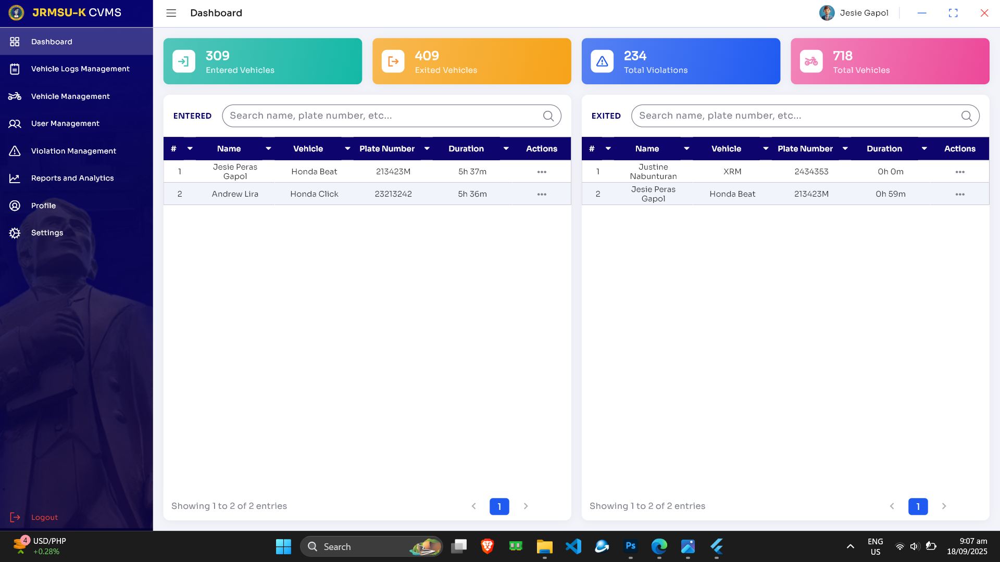
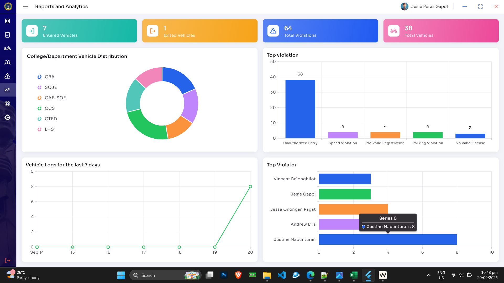
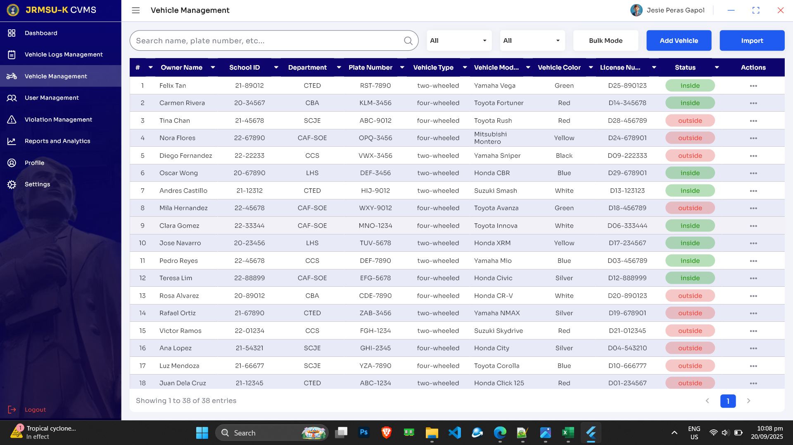
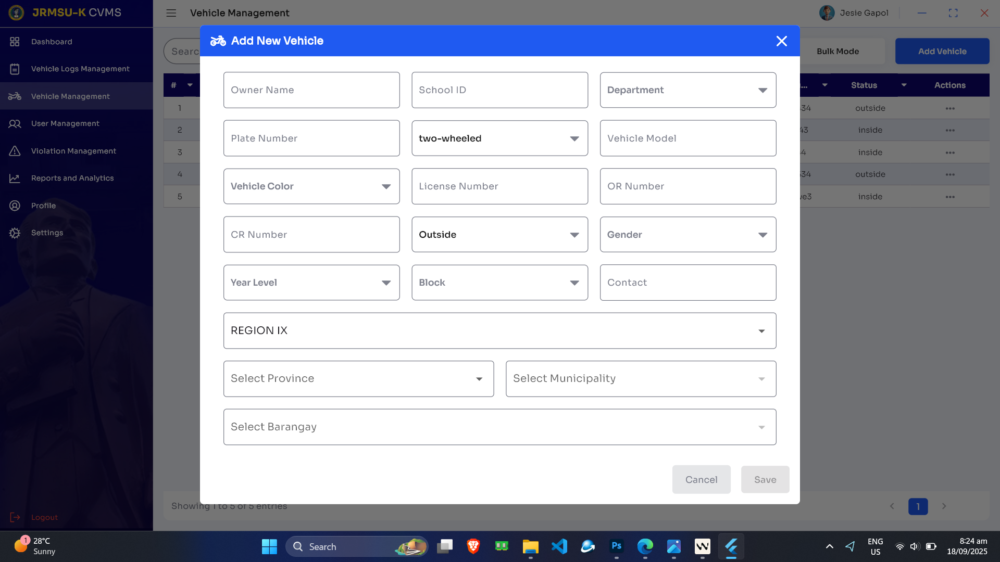
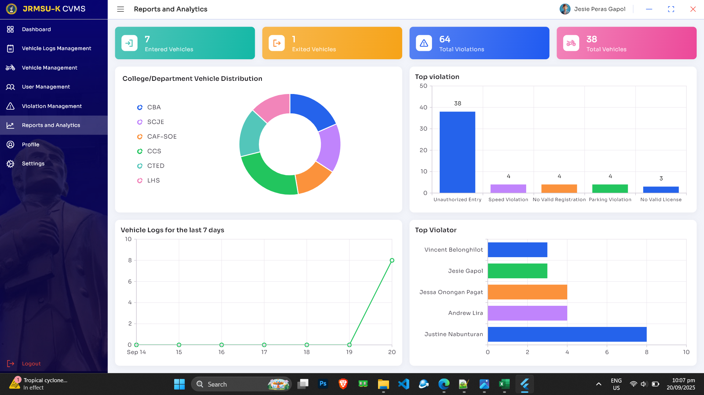

## 📱 Screenshots (Current Pages)

| Page                 | Preview                                                                |
| -------------------- | ---------------------------------------------------------------------- |
| Login Page           |                      |
| Register Page        |                |
| Forgot Password Page |      |
| Email Sent Page      |            |
| Dashboard Page       |              |
| Collapsed Sidebar    |        |
| Vehicle Management   |      |
| Vehicle Bulk Mode    |  |
| File trigger         |            |
| Vehicle Logs Page    |        |
| Vehicle Log Bulk     |          |
| Add Vehicle Dialog   |      |
| Add Log Dialog       |              |
| View QR Dialog       |              |
| Violation Management |  |
| User Management      |            |
| Reports Analytics    |        |
| Empty Search         |                  |
| Profile Page         |                  |
| Settings Page        |                |
